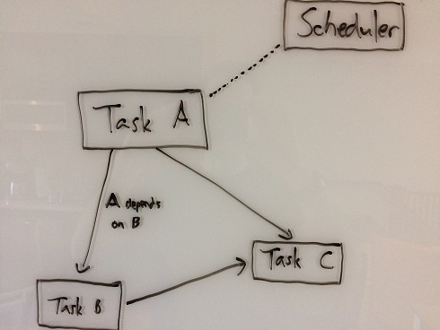

#2. The Danger in Models

Modeling a problem, especially in terms of objects and their inter-relationships, is something I do pretty naturally. For example, I recently worked on a task system where interdependent units of work (tasks) are scheduled and executed in a way that (ideally) makes good utilization of available CPU under dependency constraints. Thinking about the problem, I started by sketching out a directed acyclic graph on the whiteboard. Tasks were nodes and dependencies were edges. I threw in a scheduler to 'manage' things.



As a tool to think about the problem, this model was fine and good. It all went horribly wrong when I, reflexively and without thinking, started to map this model directly to code.

```c++
	struct task_t
	{
		task_function_t entry_point;
		void* user_data;
	
		std::vector<task_t*> depends_on;
	};
	
	struct task_graph_t
	{
		task_t* root;
	};
	
	struct task_scheduler_t
	{
		//...
	};
```

Given these objects, I needed a way to declare tasks. Maybe I could declare sub-graphs statically, perhaps even in data? And then write a sweet tool to create and debug graphs? I saw a neat widget on GitHub to visualize DAGs...

**Wait, what the heck am I even doing!?** Oh right, I am trying to make efficient use of available CPU. Somehow I have managed to create all kinds of new and exciting problems for myself, each successively less related to actually solving the real problem.

It gets worse. If I actually build that DAG tool, maybe I use, say, C#/WPF. Now I have to deal with whole other language and WPF's conceptual model. Maybe that gets a little too intense for little old me, so I get another programmer to handle the tool part. Unchecked, this devolves into a situation know no one programmer understands the whole system. And nothing good comes from that.

Luckily for me and my task system, thanks [Christian Gyrling at Naughty Dog](http://gdcvault.com/play/1022186/Parallelizing-the-Naughty-Dog-Engine), there was a better way. The upshot: Don't explicitly model the task graph. Make it implicit in the flow. That was easy.

Mapping mental models directly code, obscuring the real problem in a bunch of model problems, and then writing more code to work around the problems in the model, I pull this stunt a lot. Reading up on the state of web development after last paying attention ~20 years ago, it occurs to me that perhaps I am not the only one.
